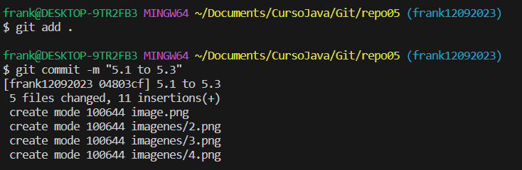
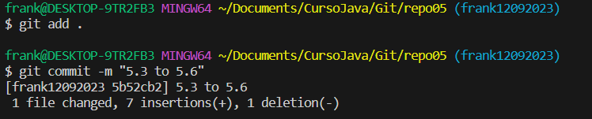
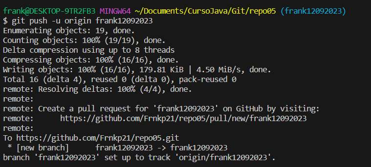
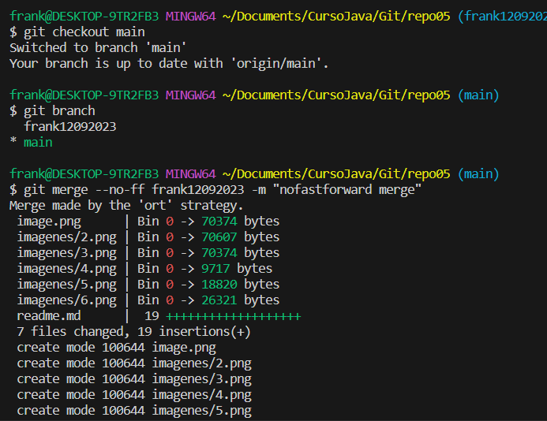
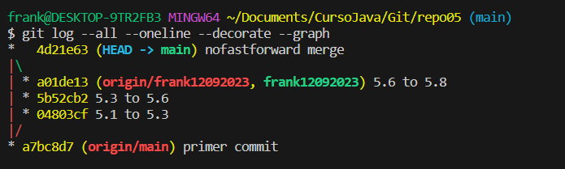
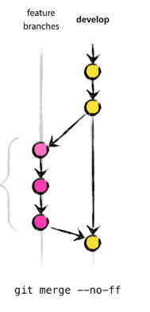
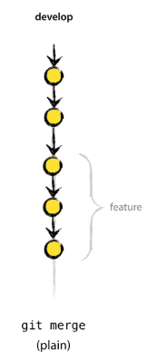

# EJERCICIO 5: NO FAST FORWARD

## 5.1 – Crea un directorio llamado repo05, esta vez tu decides como lo haces. Es decir, tendrás que seleccionar uno de los dos caminos que hemos visto en los dos ejercicios anteriores. Pero si que queremos que exista el repositorio el local y en remoto.

## 5.2 – Crea el fichero readme.md

## 5.3 - Crea una rama con tu nombre y la fecha actual (por ejemplo en mi caso la rama se llamará david02032022) y sitúate en dicha rama

## 5.4 – Haz 3 commits en la rama (david02032022)

## 5.5 – En este caso, antes de hacer el merge sube ambas ramas al repositorio remoto. Verifica que se hayan subido correctamente. Lo hacemos así, ya que cuando realicemos el merge si nos equivocas podemos volver a clonar el repositorio sin necesidad de tener que volver a comenzar el ejercicio de 0.

## 5.6 – Basándote en el ejemplo que hemos visto anteriormente, realiza un commit no fast-forward en el que mergearemos la rama david02032022 con master.

## 5.7 – Visualiza el resultado tanto mediante el comando git log --all --oneline --decorate --graph, como desde el pluging de VSC

## 5.8 – Explica las diferencias entre un merge FF y un merge no FF

*En el merge FF se juntaran con el main todos los commits que hemos creado en la branch y se veran todos los commits paso por paso, en cambio en el merge no ff en una branch los commits que hagamos se fusionaran en uno y solo ese se movera al main.*

**Merge No FF**

**Merge FF**

